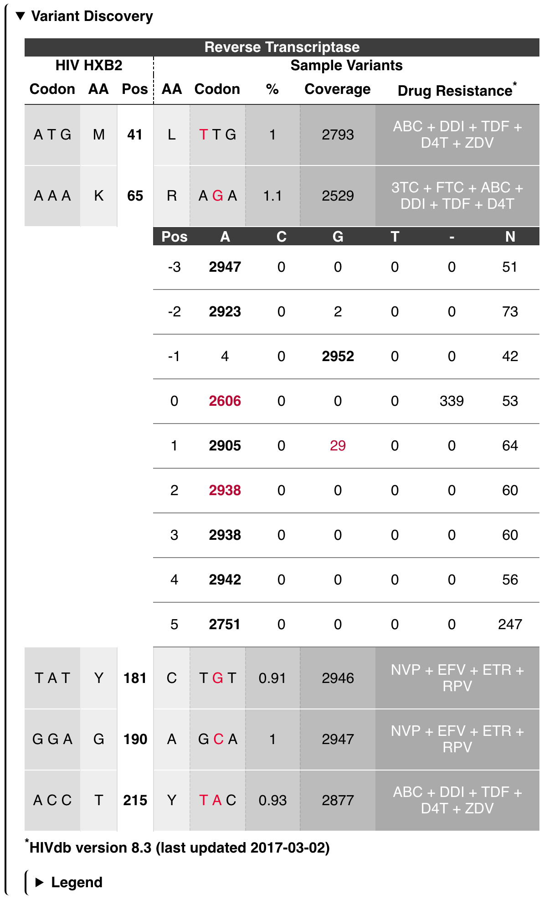
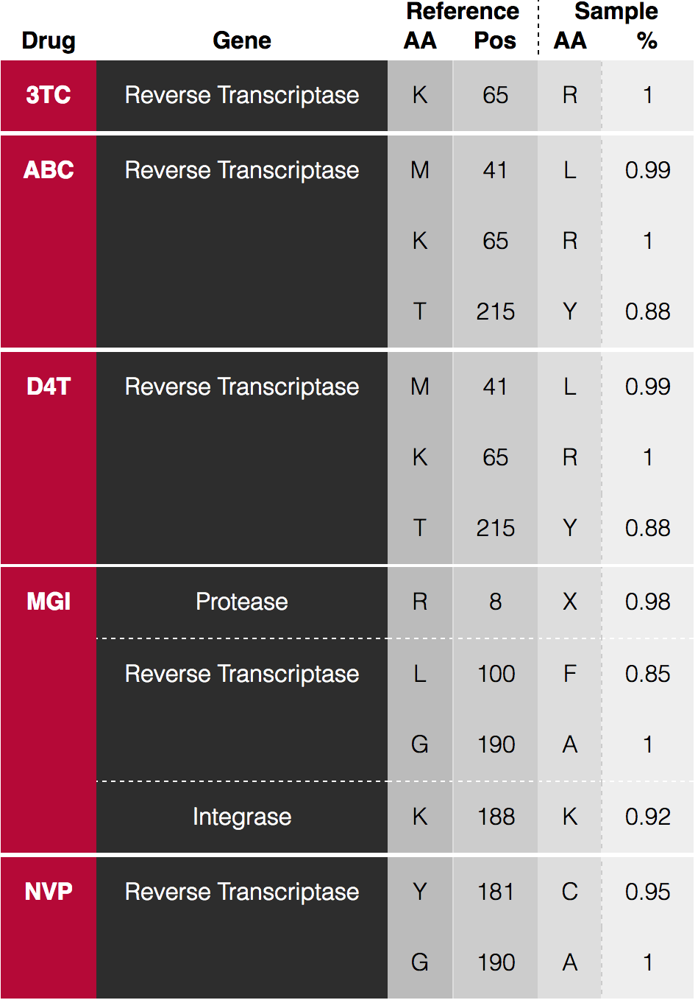
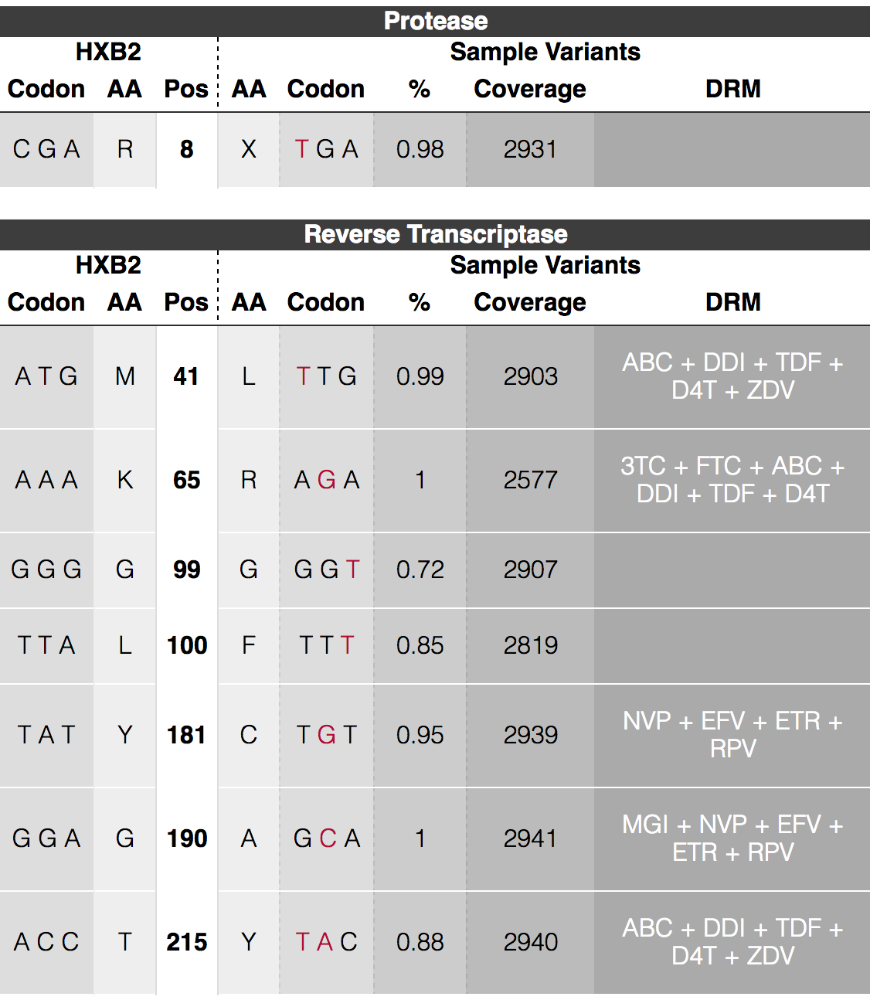
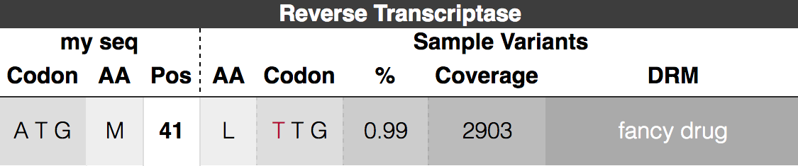
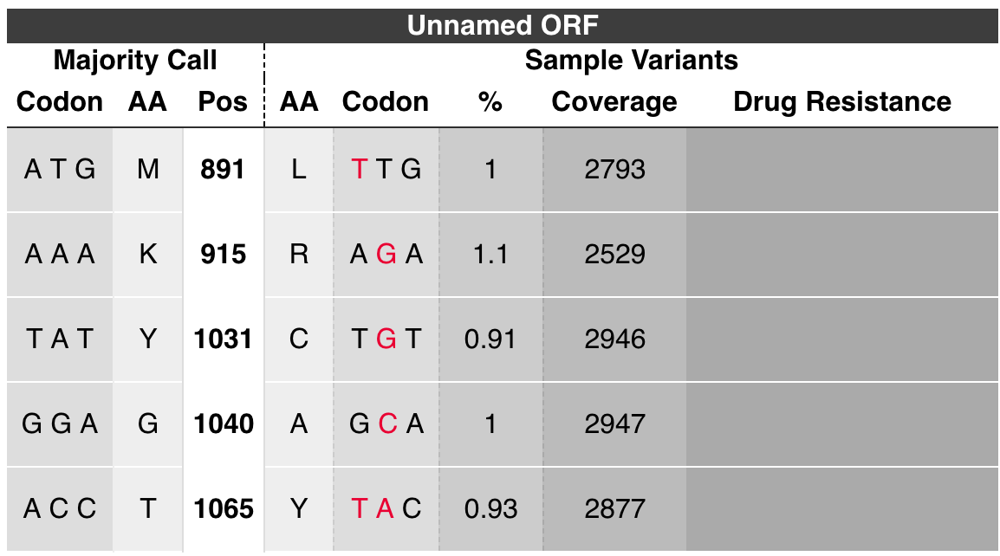
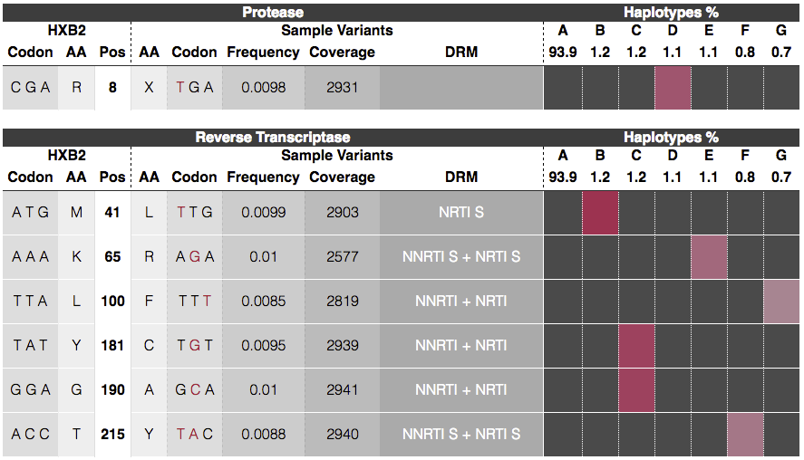
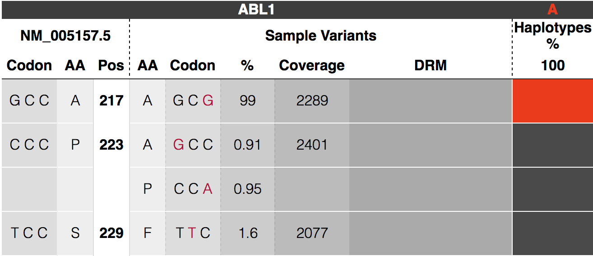

<h1 align="center">
    juliet - Minor Variant Caller
</h1>

<p align="center">
  
</p>

## Install

Install the minorseq suite using simple cmake:
[INSTALL.md](INSTALL.md). `juliet` is a final binary executable.

## Input data
*Juliet* operates on CCS records in the BAM format.
Reads should be created with [CCS2](https://github.com/PacificBiosciences/unanimity/blob/master/doc/PBCCS.md)
using the `--richQVs` option.
BAM files have to PacBio-compliant, meaning, cigar `M` is forbidden.
*Juliet* currently does not demultiplex barcoded data;
provide one BAM per barcode.

## Scope
Current scope of *Juliet* is identification of codon-wise variants in coding
regions. A first version of variant phasing is available. True insertion and
deletion variants are currently being ignored; support will be added in a
future version.

## Output
*Juliet* provides a JSON and/or HTML file:
```
$ juliet data.align.bam patientZero.html
$ juliet data.align.bam patientZero.json
$ juliet data.align.bam patientZero.html patientZero.json
```

The HTML page is a 1:1 conversion of the JSON file and contains the identical
information, but more human-readable.

The HTML file contains three sections:
 1. Input data
 2. Variant Discovery
 3. Drug Summaries

### Section 1. Input data

This section of the HTML output summarizes the data provided, the
exact call for *juliet*, and version of *juliet* for traceability
purposes

### Section 2. Variant Discovery

For each gene open reading frame, there is one overview table.
Each row represents a variant position.
Each variant position consists of the reference codon, reference amino acid,
relative amino acid position in the gene, the mutated codon, the mutated amino acid,
the coverage, and possible annotated drug resistance mutations. Clicking the row will show
counts of the multiple-sequence alignment counts of the -3 to +3 context positions.



### Section 3. Drug Summaries
This view summarizes the variants grouped by annotated drug mutations:



## Target configuration

*Juliet* is a multi-purpose minor variant caller that uses simple
target configuration files to define different genes of interest such
as HIV open reading frames to BCR-ABL kinase regions. There are preinstalled
configurations to ease batch applications and allow immediate reproducibility.
A target configuration may contain multiple coding regions within a gene sequence and optional drug
resistance mutation positions.

### Predefined target config
Running on predefined genome such as HIV:
```
$ juliet -c "<HIV>" data.align.bam patientZero.html
```



Currently available configs are: `<HIV>`

### Customized target configuration
To define your own target configuration, create a JSON file. The root child genes contains a list of coding regions, with
begin and end, the name of the gene, and a list of drug resistent mutations
drms. Each DRM consists of its name and the positions it targets. The "drms"
field is optional. If provided, the referenceSequence is being used to call
mutations, otherwise it will be tested against the major codon. All indices are
with respect to the provided alignment space, 1-based, begin-inclusive and
end-exclusive `[)`.
Here is a "hiv.json" target configuration file:
```
{
    "genes": [
        {
            "begin": 2550,
            "drms": [
                {
                    "name": "fancy drug",
                    "positions": [ "M41L" ]
                }
            ],
            "end": 2700,
            "name": "Reverse Transcriptase"
        }
    ],
    "referenceName": "my seq",
    "referenceSequence": "TGGAAGGGCT..."
}
```

Run with customized target config using the `-c` option:
```
$ juliet -c hiv.json data.align.bam patientZero.html
```



Valid formats for `drms/positions`

    "103"     <- only the reference position
    "M130"    <- reference amino acid and ref pos
    "M103L"   <- ref aa, ref pos, mutated aa
    "M103LKA" <- ref aa, ref pos, list of possible mutated aas
    "103L"    <- ref pos and mut aa
    "103LG"   <- ref pos and list mut aas

Missing amino acids are processed as wildcard `*`

Example

    { "name": "ATV/r", "positions": [ "V32I", "L33", "46IL", "I54VTALM", "V82ATFS", "84" ] }

### No target config
If no target config has been specific, it is recommended to at least specify the
region of interest to mark the correct reading frame so amino acids are correctly translated. The output will be labeled
with unknown as gene name:
```
$ juliet data.align.bam patientZero.html
```



## Phasing

*Juliet* default mode is to call amino-acid / codon variants independently. Using `--mode phasing`,
variant calls from distinct haplotypes are clustered and visualized in the
HTML output. The row-wise variant calls are "transposed" onto per column
haplotypes. For each variant, the haplotype shows a colored box indicating the variants that co-occur, wild type is
represented by plain dark gray. A color gradiant helps to distinguish between
columns.



The JSON variant positions has an additional `haplotype_hit` bool array
with the length equal to the number of haplotypes. Each entry indicates if that
variant is present in the haplotype. A `haplotype` block under the root of the
JSON file contains counts and read names. The order of those haplotypes matches
the order of all `haplotype_hit` arrays.

# FAQ

### Can I use overlapping regions?
Yes! Each gene is treated separately. Overlapping region, even with different
reading frames are possible. This is important for densely encoded genomes like HIV.

### Can I call a smaller window from a target config?
Use `--region` to specify the begin-end window to subset the target config.

### What if I don't use --richQVs generating CCS reads?
Without the `--richQVs` information, the number of false-positive calls might
be higher, as *juliet* is missing information to filter actual heteroduplexes in
the sample provided.

### Why do some variants have no associated haploypes?
Scenarios as in the following figure may happen. In this case, all reads
associated to that variant contain a frame-shift deletion and
thus won't be reported.

